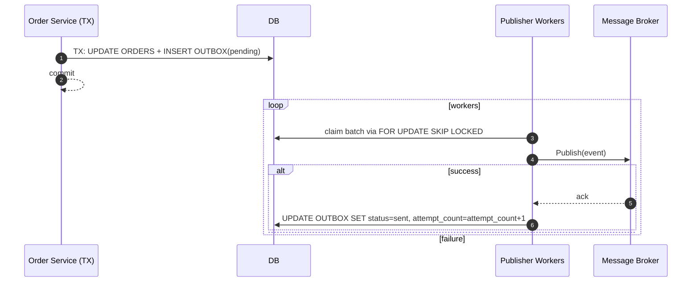

# Transactional Outbox

> Transactional Outbox Pattern для гарантированной доставки событий

**Версия:** v2.3 | **Обновлено:** 2026-02-23 | **Статус:** Implemented in core

---

## TL;DR
- Transactional Outbox: запись события в одной транзакции с бизнес-логикой.
- Publisher воркеры читают `pending`, публикуют в брокер, обновляют статус, обрабатывают ретраи/DLQ.
- Потребители обязаны быть идемпотентны (dedup по ключу сообщения).

## Назначение
Гарантировать доставку событий (at-least-once) и согласованность с БД.

## Схема таблицы
- `id text PK`
- `aggregate_type text`
- `aggregate_id text`
- `event_type text`
- `payload bytea`
- `status text` (pending|processing|sent|failed)
- `attempt_count int`
- `created_at timestamptz`
- `updated_at timestamptz`
- Индекс: `(status, created_at)`.

## Поток публикации

```mermaid
sequenceDiagram
  autonumber
  participant App as Order Service (TX)
  participant DB as DB
  participant Pub as Publisher Workers
  participant MQ as Message Broker

  App->>DB: TX: UPDATE ORDERS + INSERT OUTBOX(pending)
  App-->>App: commit
  loop workers
    Pub->>DB: claim batch via FOR UPDATE SKIP LOCKED
    Pub->>MQ: Publish(event)
    alt success
      MQ-->>Pub: ack
      Pub->>DB: UPDATE OUTBOX SET status=sent, attempt_count=attempt_count+1
    else failure
    end
  end
```

## Текущий runtime-статус
- Реализован polling worker для outbox (`claim pending/expired processing -> publish -> mark sent/failed`).
- Используется lease для `processing`-записей (2 минуты): зависшие сообщения автоматически возвращаются в обработку.
- Добавлен retry policy (exponential backoff) и fallback отправка в DLQ при исчерпании попыток.
- Worker встроен в lifecycle приложения и корректно останавливается при shutdown.

## Ретраи, DLQ и метрики
- Экспоненциальный backoff + jitter; после N попыток → `failed` и отправка в DLQ.
- Репроцессинг DLQ — вручную/автоматически под мониторингом.
- Метрики: `oms_outbox_pending_records`, `oms_outbox_oldest_pending_age_seconds`, `oms_outbox_publish_attempts_total{result}`.

## Идемпотентность потребителей
- Ключ сообщения: `(aggregate_type, aggregate_id, event_type, seq/ts)`.
- Consumer хранит `processed_events` и игнорирует дубликаты.

## Альтернативы
- CDC (Debezium) — меньше кода, сложнее эксплуатация.
- 2PC/XA — строгая атомарность, но высокая сложность и блокировки.
