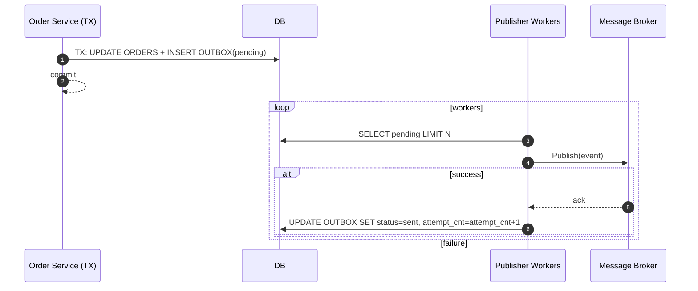

# Transactional Outbox

> Transactional Outbox Pattern для гарантированной доставки событий

**Версия:** v2.1 | **Обновлено:** 2026-02-14 | **Статус:** In progress

---

## TL;DR
- Transactional Outbox: запись события в одной транзакции с бизнес-логикой.
- Publisher воркеры читают `pending`, публикуют в брокер, обновляют статус, обрабатывают ретраи/DLQ.
- Потребители обязаны быть идемпотентны (dedup по ключу сообщения).

## Назначение
Гарантировать доставку событий (at-least-once) и согласованность с БД.

## Схема таблицы
- `id uuid PK`
- `aggregate_type text`
- `aggregate_id uuid`
- `event_type text`
- `payload json/jsonb`
- `status text` (pending|sent|failed)
- `attempt_cnt int`
- `created_at timestamptz`
- `updated_at timestamptz`
- Индексы: `(status, created_at)`, `(aggregate_type, aggregate_id)`.

## Поток публикации

## Текущий runtime-статус
- Реализован polling worker для outbox (`pull pending -> publish -> mark sent/failed`).
- Добавлен retry policy (exponential backoff) и fallback отправка в DLQ при исчерпании попыток.
- Worker встроен в lifecycle приложения и корректно останавливается при shutdown.

## Ретраи, DLQ и метрики
- Экспоненциальный backoff + jitter; после N попыток → `failed` и отправка в DLQ.
- Репроцессинг DLQ — вручную/автоматически под мониторингом.
- Метрики: `outbox_pending_records`, `outbox_oldest_pending_age_seconds`, `outbox_publish_attempts_total{result}`, `outbox_dlq_total`.

## Идемпотентность потребителей
- Ключ сообщения: `(aggregate_type, aggregate_id, event_type, seq/ts)`.
- Consumer хранит `processed_events` и игнорирует дубликаты.

## Альтернативы
- CDC (Debezium) — меньше кода, сложнее эксплуатация.
- 2PC/XA — строгая атомарность, но высокая сложность и блокировки.
