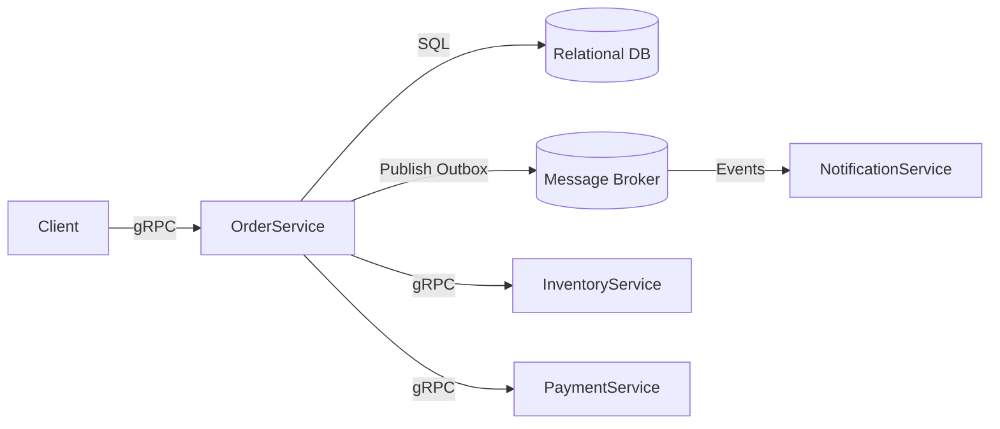

# Architecture

> Общая архитектура Order Management System

**Версия:** v2.0 | **Обновлено:** 2025-10-01 | **Статус:** Актуально

---

## TL;DR
- OMS — бэкенд для жизненного цикла заказа с явной оркестрацией саг.
- Синхронно — gRPC; асинхронно — события через брокер, публикация из Outbox.
- Чистые слои: Transport → Application → Domain → Infrastructure.

## Компоненты
- `OrderService`: публичный gRPC API, оркестратор саг, доступ к БД, Outbox.
- `InventoryService`: резерв/освобождение стока (внутренний или внешний).
- `PaymentService`: Hold/Capture/Refund (внутренние адаптеры к провайдерам).
- `NotificationService`: потребляет события и уведомляет пользователей/системы.
- Реляционная БД: транзакционное хранилище (orders, items, payments, reservations, outbox, idempotency).
- Брокер сообщений: распределение доменных событий.

## Коммуникации
- Синхронно (внутри/снаружи): gRPC с дедлайнами, ретраями (только идемпотентные), circuit breaker.
- Асинхронно (межсервисно): доменные события через брокер (at-least-once; потребители — идемпотентные).

## Слои
- Transport (gRPC)
- Application (оркестратор, use-cases)
- Domain (агрегаты, инварианты)
- Infrastructure (БД, брокер, Outbox, репозитории)

## Диаграмма

## Ключевые решения
- Оркестрация саг с компенсациями (явные шаги, управляемые ошибки).
- Transactional Outbox → публикация событий с ретраями и DLQ.
- Идемпотентность: `Idempotency-Key` в gRPC metadata; дедуп на consumer.
- Optimistic Locking (`orders.version`) против гонок записей.

## Альтернативы (кратко)
- REST вместо gRPC — проще онбординг внешних, менее строгий контракт.
- NATS JetStream вместо Kafka/Redpanda — проще оперировать, меньше возможностей реплея.
- Workflow-движок (Temporal) — мощно для длительных процессов, но сложнее эксплуатация.

## Быстрая навигация
- Подробности по слоям и шагам саг: `docs/saga.md`
- Модель данных и статусы: `docs/data-model.md`
- Контракты gRPC и ошибки: `docs/api.md`
- Outbox и гарантии доставки: `docs/outbox.md`

