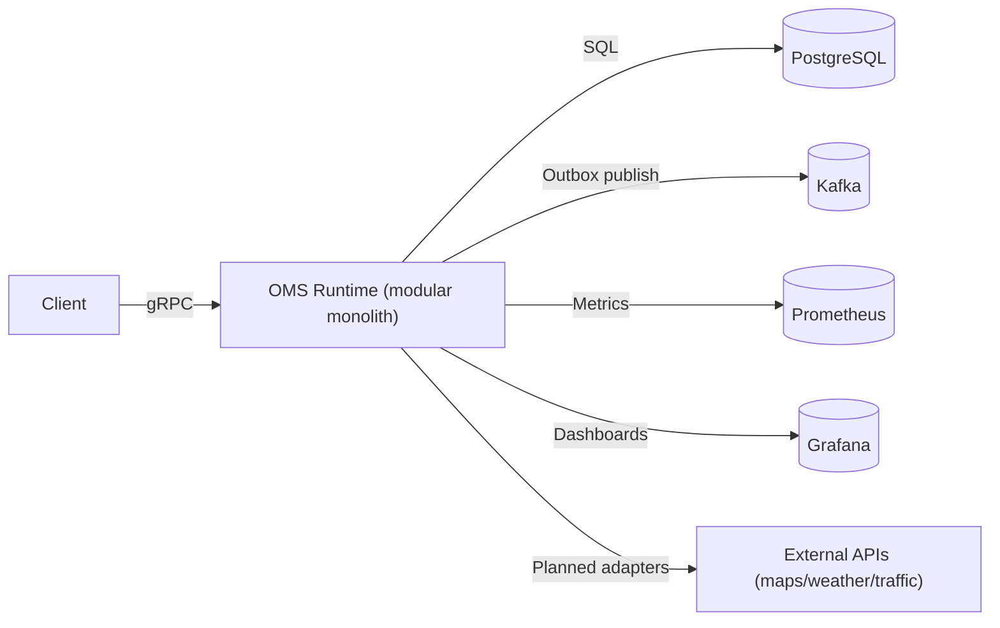

# Architecture

> Актуальная архитектурная рамка OMS на этапе перехода к BoostMarket

**Версия:** v3.2 | **Обновлено:** 2026-03-08 | **Статус:** Sprint 3 Active

---

## TL;DR
- Базовая архитектура: **модульный монолит** (не микросервисная декомпозиция на этом этапе).
- Ядро OMS стабилизировано: lifecycle заказа + saga + outbox + idempotency + observability.
- Delivery-функции (курьеры/гео/слоты/рейтинг/ценообразование) добавляются модульно в тот же runtime.
- Внешние geo/weather/traffic интеграции пока в roadmap, не в текущем runtime-path.

## Архитектурный контур

1. Transport layer:
- gRPC API (`OrderService` и последующие delivery API).

2. Application layer:
- Оркестрация use-case и saga-процессов.
- Фоновые воркеры (outbox, idempotency cleanup).
- gRPC `CourierService` для курьеров/зон/слотов/capabilities/рейтинга.

3. Domain layer:
- Агрегаты и инварианты заказа.
- Новые delivery-сущности: курьеры, зоны, слоты, транспортные ограничения.

4. Infrastructure layer:
- PostgreSQL (основное runtime-хранилище), in-memory (локальный режим/тесты).
- Kafka для доменных событий и DLQ.
- Prometheus/Grafana для метрик и эксплуатационного контроля.

## Диаграмма (текущая фаза)

```mermaid
flowchart LR
  Client -->|gRPC| OMS["OMS Runtime (modular monolith)"]
  OMS -->|SQL| DB[(PostgreSQL)]
  OMS -->|Outbox publish| Kafka[(Kafka)]
  OMS -->|Metrics| Prom[(Prometheus)]
  OMS -->|Dashboards| Grafana[(Grafana)]
  OMS -->|Planned adapters| Ext["External APIs (maps/weather/traffic)"]
```

## Почему модульный монолит сейчас

- Быстрее доставка бизнес-фич без overhead распределённой системы.
- Проще эксплуатация и дебаг в ранней стадии стартапа.
- Меньше операционных рисков при активной смене бизнес-правил.
- Переход к сервисной декомпозиции возможен позже, после стабилизации доменных границ.

## Инварианты архитектуры

- Нет несанкционированных breaking-изменений DB/API.
- Для событий сохраняется at-least-once семантика + идемпотентность обработчиков.
- Любые внешние интеграции проходят через адаптеры с timeout/retry/circuit breaker.
- Источник истины для готовности — CI pipeline и воспроизводимые проверки.

## Связанные документы

- Roadmap: `docs/roadmap.md`
- Saga: `docs/architecture/saga.md`
- Idempotency: `docs/architecture/idempotency.md`
- Transactional Outbox: `docs/architecture/outbox.md`
- Runbooks: `docs/operations/runbooks.md`
