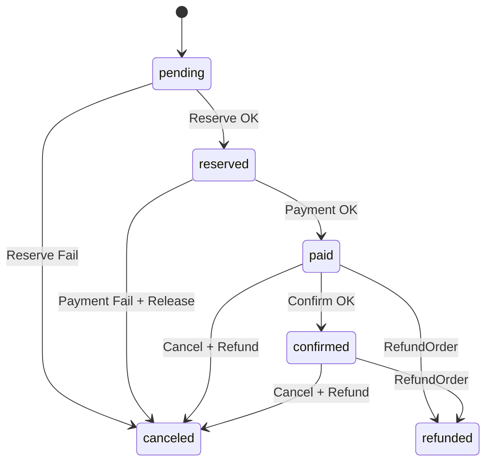

# Saga Orchestration

> Текущая реализация orchestration-потока для lifecycle заказа

**Версия:** v2.1 | **Обновлено:** 2026-02-23 | **Статус:** Актуально

---

## TL;DR
- Основной сценарий: `Create -> PayOrder -> Start saga -> Reserve -> Pay -> Confirm`.
- Компенсации: при ошибках выполняются `Release` и/или `Refund`, итоговый статус обычно `canceled`.
- Выполнение saga асинхронное относительно gRPC mutating RPC.
- Идемпотентность внешнего вызова обеспечивается на уровне `idempotency-key` в gRPC layer.

## Машина состояний заказа

## Что делает оркестратор сейчас

### `Start(orderID)`
1. Загружает заказ.
2. Если `status=pending` -> пробует Reserve.
3. Если `status=reserved` -> пробует Pay.
4. Если `status=paid` -> Confirm.
5. Для уже терминальных/обработанных статусов — no-op.

### `Cancel(orderID, reason)`
- Для `reserved|paid|confirmed` освобождает резерв.
- Для `paid|confirmed` дополнительно вызывает Refund.
- Переводит заказ в `canceled`.

### `Refund(orderID, amount, reason)`
- Доступен для `paid|confirmed`.
- После успешного refund переводит заказ в `refunded`.

## Обработка ошибок
- Ошибки резервирования/оплаты приводят к компенсации и переходу в терминальное состояние.
- Конфликты optimistic locking обрабатываются retry-механикой внутри save/update path.
- Retry-wrapper (`RetryableOrchestrator`) для `Start/Cancel/Refund` сейчас логически отключён, так как методы интерфейса не возвращают `error`.

## Наблюдаемость
- Метрики по сагам: старт/успех/ошибка/длительность/in-flight.
- Timeline события сохраняются для ключевых переходов статусов.
- События saga/order публикуются в Kafka через outbox-путь.

## Ограничения текущей версии
- Нет workflow-engine уровня Temporal/Step Functions.
- Нет внешнего дедуп/reconcile процесса по платежам (кроме текущих доменных проверок).
- Нет fine-grained retry policy per external step на уровне публичного API оркестратора.

## Связанные документы
- `docs/architecture/outbox.md`
- `docs/architecture/idempotency.md`
- `docs/operations/runbooks.md`
