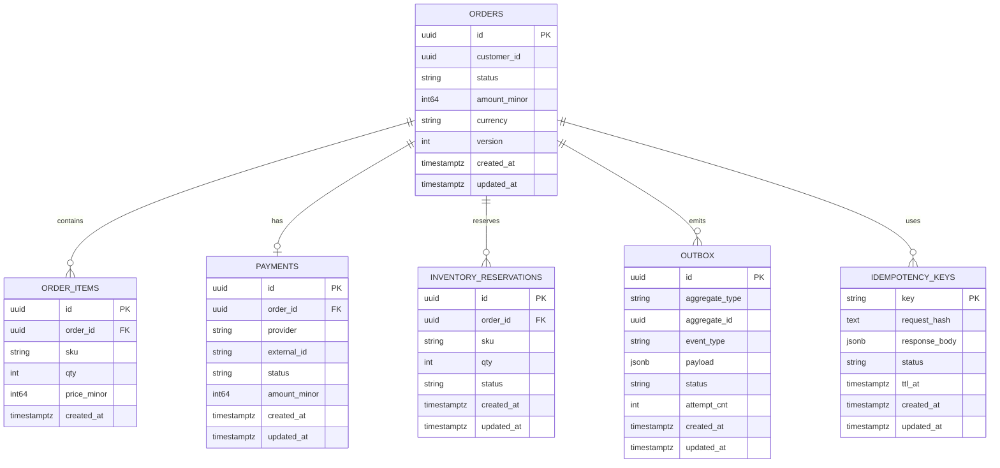

# Data Model

Версия: v1.1 • Последнее обновление: 2025-09-27

## TL;DR
- Нормализованная модель: `orders`, `order_items`, `payments`, `inventory_reservations`, `outbox`, `idempotency_keys`.
- Денежные суммы — minor units (`int64`).
- Конкуренция — optimistic locking (`orders.version`).
- Первые кандидаты на партиционирование/TTL: `outbox`, `idempotency_keys`.

## Назначение
Логическая ERD, схемы таблиц, ограничения, индексы и стратегия версионирования для OMS.

## ER-диаграмма (логическая)

## Таблицы (предложение)
- Orders
  - Поля: `id`, `customer_id`, `status`, `amount_minor`, `currency`, `version`, `created_at`, `updated_at`.
  - Индексы: по `status`, по `(customer_id, created_at desc)`, по `created_at`.
  - Ограничения: суммы неотрицательны; формат валюты; `version` для optimistic locking.

- Order Items
  - Поля: `id`, `order_id`, `sku`, `qty>0`, `price_minor>=0`, `created_at`.
  - Индексы: по `order_id`, по `sku`.

- Payments
  - Поля: `id`, `order_id`, `provider`, `external_id (unique nullable)`, `status`, `amount_minor`, временные метки.
  - Индексы: по `order_id`, `status`, `(provider, external_id)`.

- Inventory Reservations
  - Поля: `id`, `order_id`, `sku`, `qty>0`, `status`, временные метки.
  - Индексы: по `order_id`, `sku`, `status`.

- Outbox
  - Поля: `id`, `aggregate_type`, `aggregate_id`, `event_type`, `payload`, `status (pending|sent|failed)`, `attempt_cnt`, временные метки.
  - Индексы: `(status, created_at)`, `(aggregate_type, aggregate_id)`.

- Idempotency Keys
  - Поля: `key`, `request_hash`, `response_body`, `status (processing|done|failed)`, `ttl_at`, временные метки.
  - Индексы: `ttl_at`, `status`.

## Статусы
- Orders: `pending|reserved|paid|confirmed|canceled|refunded` (soft-enum через check-constraint для упрощения миграций).
- Payments: `pending|authorized|captured|refunded|failed`.
- Reservations: `pending|reserved|released|failed`.

## Представление денежных сумм
- Minor units (`int64`) для избежания ошибок округления.

## Версионирование и конкуренция
- Optimistic locking через `orders.version` и обновления `WHERE id=? AND version=?`; при конфликте → ретрай.

## Партиционирование и хранение (в будущем)
- Сначала рассмотреть партиционирование по времени для `outbox` и `idempotency_keys`; для `orders` — по мере необходимости.

## Инварианты
- `orders.amount_minor = sum(order_items.qty * order_items.price_minor)` — проверять в приложении; опционально аудит/триггер.

## Альтернативы
- Enum-типы против text+check: начать с text+check для простых миграций.
- Decimal в БД против minor units: стандартизировать minor units на уровне домена и БД.

