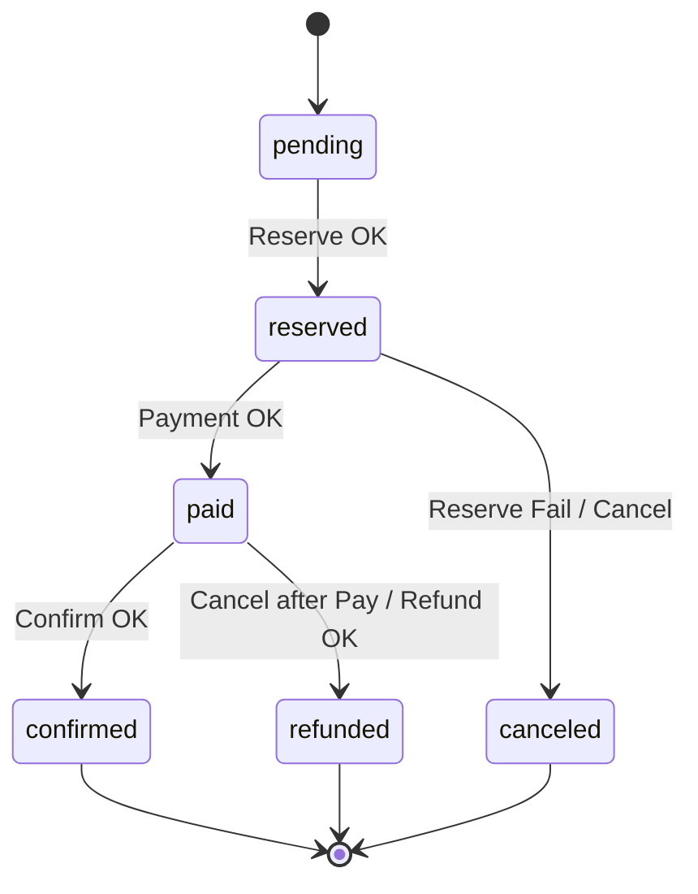
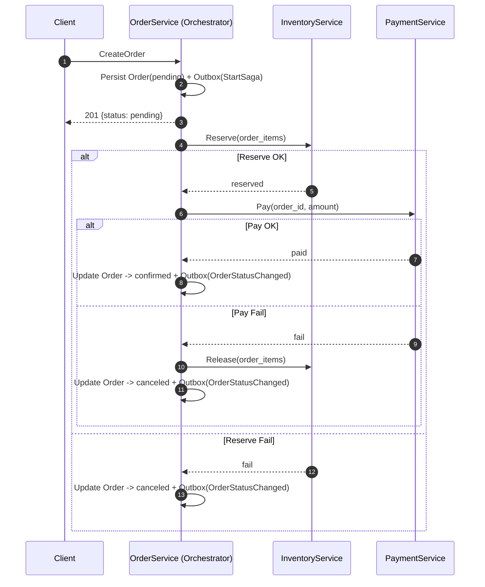

# Saga Orchestration

Версия: v1.1 • Последнее обновление: 2025-09-27

## TL;DR
- Основной поток: Create → Reserve → Pay → Confirm.
- Компенсации: при отказе — Release → Cancel; при отмене после оплаты — Refund → Cancel.
- Таймауты и ретраи: короткие дедлайны, экспоненциальный backoff + jitter; `unknown` → сначала reconcile.
- Идемпотентность: шаги повторяемы без «двойного эффекта», события — через outbox, consumer с дедупликацией.

## Назначение
Детальный дизайн оркестрации саг: состояния, шаги, компенсации, таймауты/ретраи, идемпотентность и краевые случаи.

## Машина состояний заказа

## Основной поток и компенсации

## Таймауты и ретраи
- Reserve: дедлайн 1–5 с; до 3 попыток с экспоненциальной задержкой и jitter.
- Pay (Hold/Capture): дедлайн 3–10 с; 3–5 попыток; при `indeterminate` — reconcile статуса.
- Release/Refund (компенсации): до 5 попыток, повышенный приоритет.

## Классификация ошибок
- Временные (transient): сеть/таймауты — ретраи.
- Бизнес-отказы: нехватка стока, отклонён платёж — компенсации.
- Неопределённые: неизвестный исход — сначала reconcile, затем решение.

## Идемпотентность шагов
- Внешние вызовы должны быть идемпотентны по `order_id`/`payment_id`.
- Внутренние обновления защищены optimistic locking по `orders.version`.
- События публикуются через outbox; потребители выполняют дедупликацию.

## Ре-энтерабельность и восстановление
- Оркестратор безопасно повторяет шаги после рестарта, сверяясь с текущим статусом заказа.
- При сбое между шагами: переоценка состояния и продолжение или компенсация.

## Стратегия конкуренции
- Один активный оркестратор на `order_id` (шардинг/очередь по ключу).
- При конфликте версий: ретрай с backoff; при «горячем» ключе — очередь/лок на ключ.

## Краевые случаи
- Повторная попытка оплаты: обеспечивать идемпотентность у провайдера и делать reconcile перед новой попыткой.
- Частичный резерв (вне MVP): либо «всё или ничего», либо отдельный поток.
- Неопределённый статус оплаты (202): периодические проверки; подтверждать только при `paid`.
- Сбой компенсации: агрессивные ретраи, DLQ, ручной runbook.

## Наблюдаемость
- Спаны: на каждый шаг; атрибуты `order.id`, `saga.step`, `retry.attempt`, `dep.name`.
- Метрики: `saga_step_duration_seconds`, `saga_flow_transitions_total`, `order_e2e_latency_seconds`.

## Альтернативы
- Хореография (слабая связность, сложные компенсации).
- TCC (требует Try/Confirm/Cancel у зависимостей).
- Workflow-движок (Temporal) для длинных и сложных процессов.

